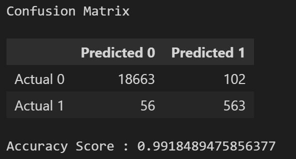
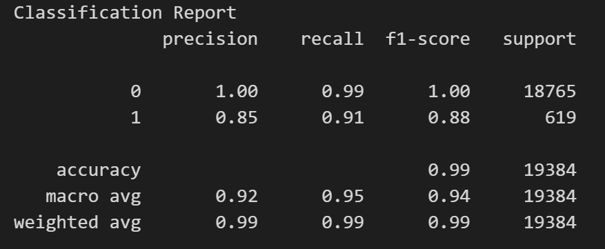

## Credit Risk Classification

### Overview of the Analysis
Provide an overview that explains the purpose of this analysis

- Evaluated the accuracy of a data model predicting the credit worthiness of borrowers 
- The dataset contained historical lending transactions  
- The analysis split data into training and testing datasets
- A logistic regression model was created using the training data. The trained model was used to make a prediction using the testing data and the model performance evaluated 

### Results

Using a bulleted list, describe the accuracy, precision, and recall scores of the machine learning model

### Summary

Summarise the results from the machine learning model. Include your justification for recommending the model for use by the company. If you don’t recommend the model, justify your reasoning

- The model accuracy is high (100%) in correctly classifying healthy and low risk loans, but relatively low performance (85%) in identifying high risk loans. 
- The model's high accuracy, precision and recall for healthy loans indicates it's quite effective at predicting healthy and low risk loans. 
- Recommended use for the modeL: if the goal is to predict low risk loans then the model appears effective, however if the goal is to predict high risk loans then the model's lower precision and recall indicates it's not suitable. The model may misclassify high risk loans as healthy loans. 
- Further improvements to the model are likely necessary if accurately identifying high risk loans is required. More data on high risk loans may be required. 

